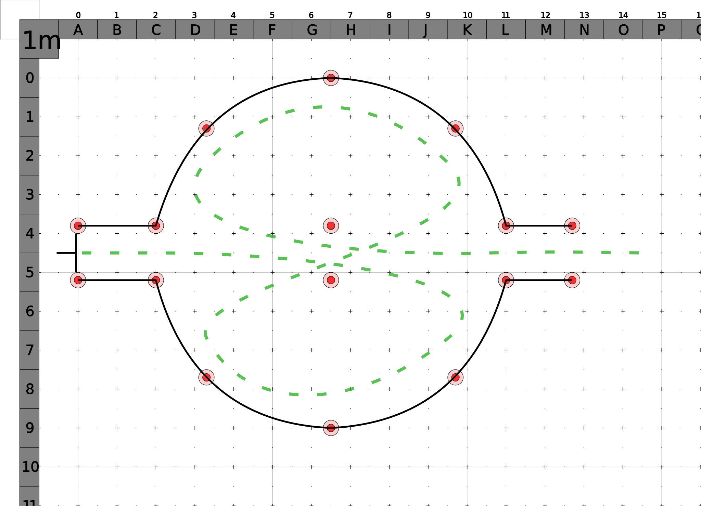

# The Big "O"

The rider enters the gate and maneuvers through the two center cones before performing a figure 8 making sure to pass through the center cones after each loop before exiting through the opposite gate.
