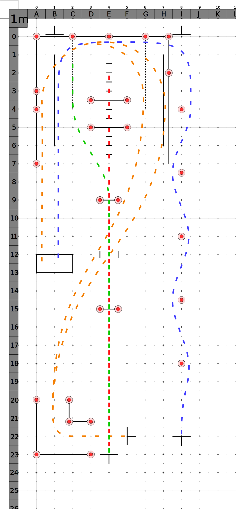

# Ohio Test

- dotted black lines for motorcycles less than 600cc

## Blue - cone weave, normal stop

- Ride to the right of the first cone, to the left of the second, and so on. Weave past all five cones without touching or skipping a cone or putting a foot down.
- Turn left and ride toward that side of the course. Make a smooth, non-skidding stop with your front tire inside that box.
- When stopped, your front tire must not touch the painted lines.

## Orange - turn from a stop, U-turn

- Make a right turn between the boundary lines. Do not touch either line.
- Diagonally, cross to the opposite side of the range and make a left u-turn inside the painted box at the far end of the
range.
- Do not touch the solid line (motorcycles 600cc or more) or the dashed line (motorcycles less than 600cc) or put a foot down.
- Stop with your front tire inside that box.

## Red - quick stop

- Accelerate straight up this path. Stabilize your speed between **20-30 km/h** by the time you reach the first line.
- Maintain a steady speed.
- When your front tire crosses the second line, stop as fast as you safely can. You will not lose points if you skid.
- Once stopped, do not allow your motorcycle to roll in either direction.

## Green - obstacle swerve

- Accelerate straight up this path. Stabilize your speed between **20-30 km/h** by the time you reach the first ine.
- Maintain a steady speed.
- When your front tire passes the second line, swerve to the (right/left).
- Avoid the obstacle line and stay to the inside of the sideline. Do not touch either line.
- Stop smoothly.
