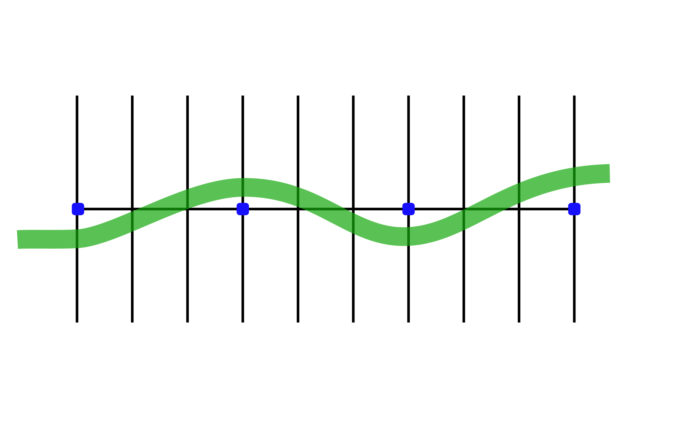
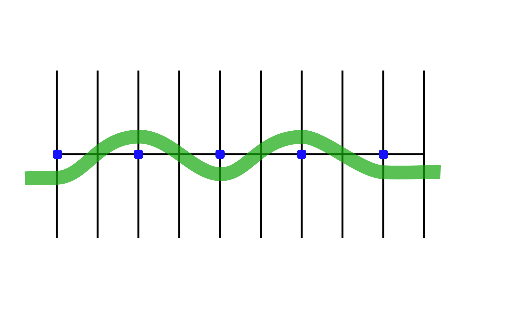

# Weaves

Practicing these exercises will help you in making lane changes in traffic or changes in direction.

## Directions

### Drill 1

30-foot Weave – Begin at one end of the parking lot lines or markers. Go to the right of the first marker, left of the second, right of the third, and so on. Practice this at **15 mph**.

### Drill 2

20-foot Weave – Proceed the same as you did in the 30-foot Weave. Practice this at **15 mph**.

## Coaching Tips
* Keep head and eyes up and knees in.
* Weave by pressing on the handle- bars in the direction you want to go. (Press right handgrip to lean right; press left handgrip to lean left.)
* Maintain a steady speed.
* Do not brake while performing weave.

## Problems & Corrections

1. Swinging too wide away from the markers.
    > Keep eyes up, looking forward, decrease lean angle; press less on the handlebars.
2. Hitting markers.
    > Keep eyes up, looking forward, increase lean angle slightly; press more on the handlebars.
3. Too much handlebar movement.
    > Maintain a steady, stable speed. Don’t slow down or brake.
