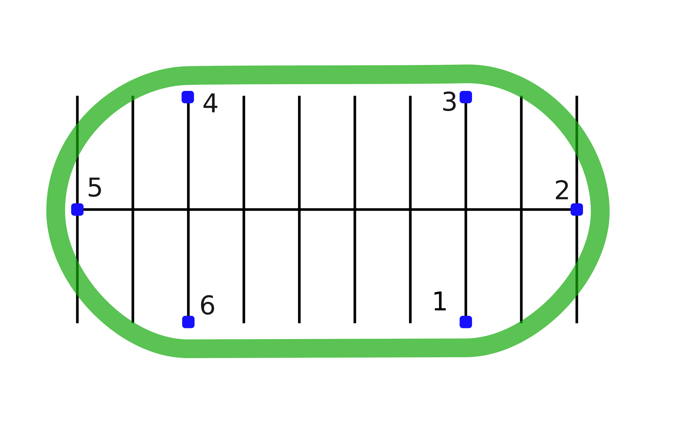

# Basic Turns

Practicing this exercise will help you with turning such as in curves on highways and winding roads.

## Directions

Ride around the oval indicated by markers 1, 2, 3, 4, 5 and 6. Adjust your speed on the straightaways by braking as necessary before the turn. Hold a steady throttle around the markers at the ends of the oval. Repeat the exercise in the other direction.

## Coaching Tips

*  Beginning speed of **10-15 mph**.
*  Slow down before the turn.
*  Look through the turn to where you want to go. Lean with the motorcycle.
*  Hold a steady speed or roll on the throttle gently through the turn.

## Problems & Corrections

1. Swinging wide of the turn.
    > Turn your head in the direction of the turn. Apply more pressure on the inside handle- bar to lean more.
2. Cutting corners too close or turning too sharply.
    > Turn your head in the direction of the turn. Do not look down. Apply less pressure to the inside handlebar. Keep a steady throttle.
3. Exiting wide out of the turn, making the oval into a circle.
    > Slow more before the turn. Turn your head in the direction of the turn. Apply more pressure on the inside handlebar to lean more.
