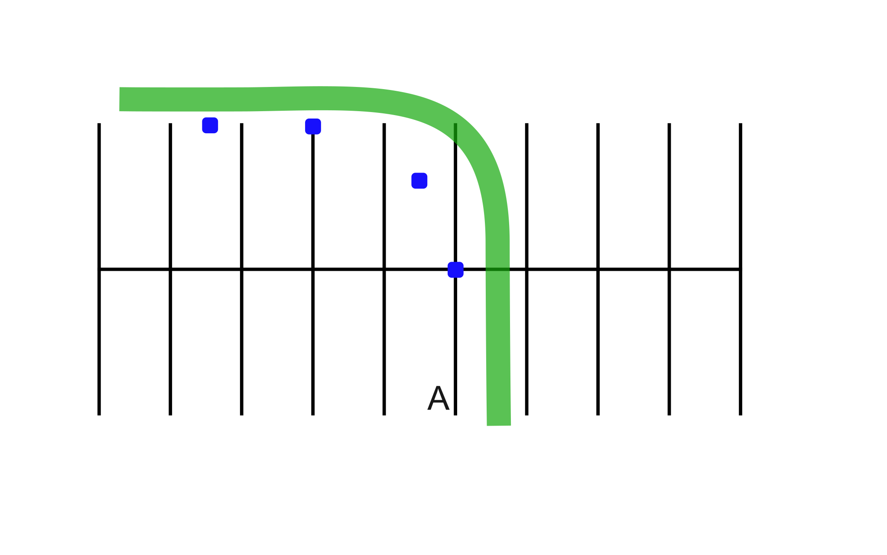

# Normal Turns

Practicing this exercise will help you further refine your turning skills.

## Directions

Start, facing marker 1 at a distance sufficient enough to increase speed to **15-20 mph**. At point “A,” reduce speed, using both brakes. As you start your turn at marker 1, look to the exit point and gently roll on the throttle throughout the turn. Roll on past marker 3 and stop beyond marker 4. Practice turning in both directions.

## Coaching Tips
* Slow down before the turn using both brakes. (Before marker 1.)
* Look through the turn, far and near, as well as to the sides.
* Lean with the motorcycle.
* Gradually increase speed throughout the turn. (Past marker 3.)

## Problems & Corrections

1. Swinging wide of the turn.
    > Slow down more before entering the turn, turn your head in the direction of the turn, press more on the inside handlebar.
2. Cutting corner too close or turning too sharply.
    > Keep head and eyes up. Do not look down. Turn your head in the direction of the turn. Press less on inside handlebar.
3. Slowing and motorcycle tends to straighten up.
    > Keep a smooth, steady throttle or slightly increase throttle to stabilize motorcycle.
