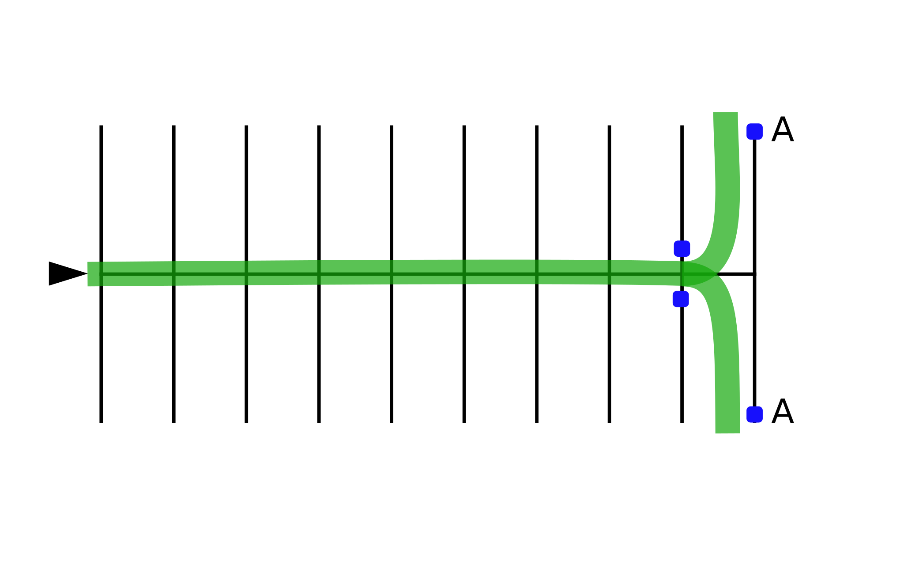

# Sharp Turns Without Stopping

Practicing this exercise will help you to make sharp turns such as pulling out of parking spaces or driveways, and turning into a driveway or onto a narrow street.

## Directions

Begin riding straight across the parking lot, increasing speed to approximately **10 mph**. Just before reaching the “Begin Turning” markers, slow down and use both brakes to adjust your speed. Then release the brakes, turn the handlebars, lean the motorcycle slightly in the direction of the turn and turn your head, looking through the intended path of travel. Use controlled clutch release and throttle as you make the sharp turn. Practice finishing your turn inside line “A,” without touching it.

## Coaching Tips
* Use both brakes to reduce speed before the turn.
* Keep head and eyes up; look through the turn to achieve a good visual picture of what lies ahead.
* Turn the handlebars and lean the motorcycle in the direction of the turn.
* Use smooth clutch release and throttle as you exit.

## Problems & Corrections

1. Turning too short or too long.
    > Keep head and eyes up and look through the turn.
2. Motorcycle stalls.
    > Use clutch and throttle smoothly to maintain necessary power to rear wheel.
3. Motorcycle begins to fall into the turn.
    > Keep head and eyes up and look through the turn, keep just enough momentum after braking to carry you through the turn.
4. Traveling too fast to make turn.
    > Slow adequately with both brakes before turning.
