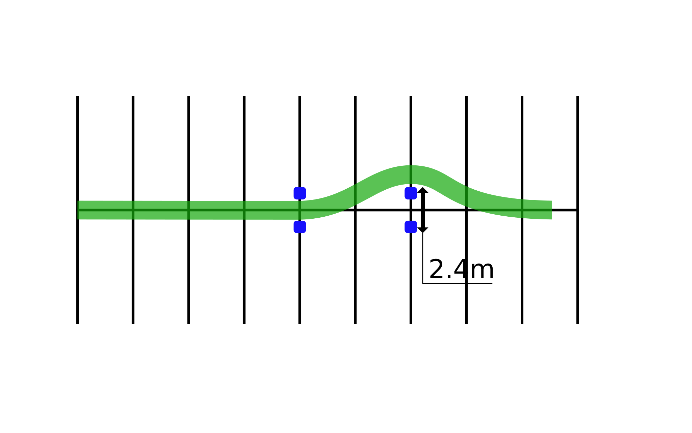

# Obstacle Swerve

Practicing this exercise will help you swerve to avoid a potential hazard.

## Directions

With about 100' lead-in, approach the first pair of markers. As you reach the markers you should be going **15-25 km/h**. As your front tire passes the first pair of markers, make a swerve (right or left) avoiding the imaginary barrier or obstacle. Make sure you’ve decided on which direction you intend to go before starting the exercise. Do not stop or apply brakes while performing the swerve.

## Coaching Tips
* To swerve right, press right until you have cleared the markers, then press left to resume straight ahead.
* Keep head and eyes up and knees in.
* Press on the handlebar in the direction you want to go.
* (Press right handgrip to go right; press left handgrip to go left.)
* **Do not brake and swerve at the same time.**

## Problems & Corrections
1. Unable to properly complete the swerve.
    > Keep a steady speed. **Maintain pressure** on the handlebar until you have cleared the marker, then press on opposite handgrip to straighten into the new path.
