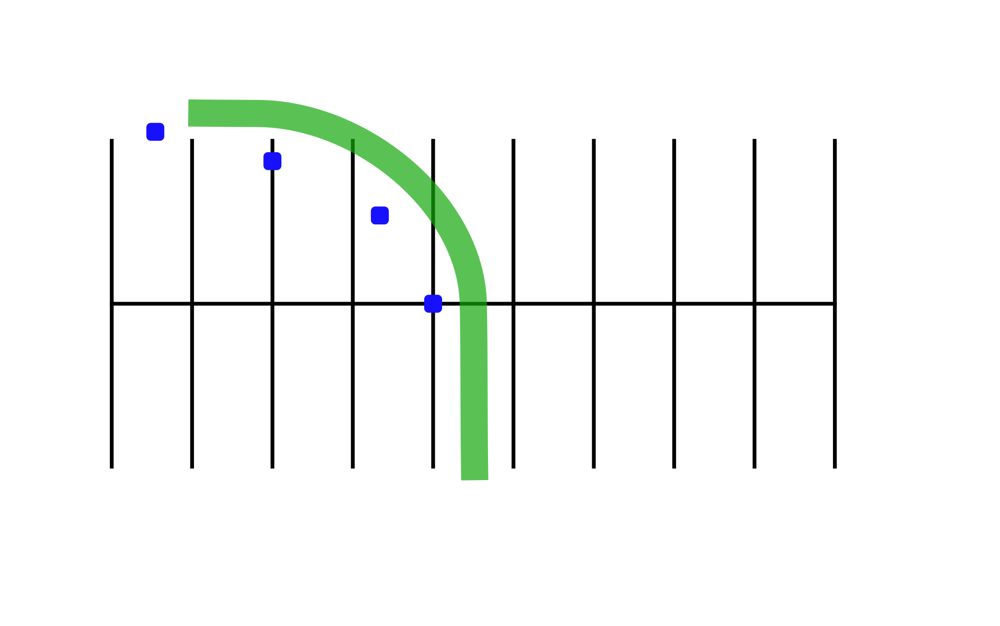

# Normal Stop on a Curve
Practicing this exercise will help you stop smoothly in a curve.

## Directions

Ride to the outside of line “A,” upshifting to second gear. As you reach marker 1, turn in the curved path indicated by markers 2, 3, and 4. Once you enter the curved path, gradually apply both brakes and downshift. Do not release the clutch. Try to come to a smooth stop with your front tire next to marker 3. Practice this at **10 mph**, then at **15 mph**.

## Coaching Tips
* Keep head and eyes up; maintain a good visual picture of where you are going.
* Straighten up the motorcycle and square the handlebars before you stop completely.
* Use both brakes smoothly to stop.
* Keep feet on pegs until almost stopped.
* When stopped, the left foot should touch the ground first, and you should be in first gear.
* Do not grab the front brake or skid either tire.

## Problems & Corrections

1. Overshooting the final marker.
    >  Gradually apply more pressure to the brakes as motorcycle straightens more.
2. Motorcycle nearly falls over.
    > Just before stopping be sure the handle- bars are square with the motorcycle. Keep eyes up. Don’t grab front brake.
3. Rear wheel skids.
    > Apply less pressure on the rear brake and make sure the motorcycle is straight up as you stop.
