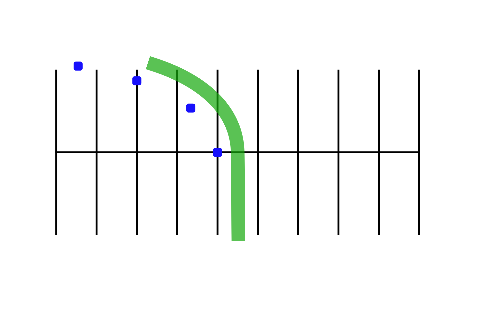

# Quick Stop on a Curve

Practicing this exercise will help you stop quickly when something suddenly appears in your path on a curve.

## Directions

Ride to the outside of line “A.” Start, facing marker 1 at a distance sufficient enough to increase speed to 10-15 mph in first gear. As you reach marker 1, turn in the curved path indicated by markers 2, 3, and 4. When your front tire passes marker 2, first straighten the motorcycle, then begin braking. You should be stopped before marker 3. Practice this at **10 mph**, then **15 mph. Do not exceed 15 mph**.

## Coaching Tips

* Keep head and eyes up; scan throughout the turn.
* Straighten motorcycle, then apply both brakes, stopping as quickly as possible.
* Keep feet on pegs until almost stopped.
* When stopped, the left foot should touch the ground first.
* Do not grab the front brake or skid either tire.

## Problems & Corrections

1. Overshooting the final marker.
    > Apply maximum pressure to the brakes once motorcycle is **straightened from the lean angle**.
2. Motorcycle nearly falls over.
    > **Straighten up** the motorcycle first, then apply the brakes. Be sure the handlebars are **square** with the motorcycle. Keep eyes up. Don’t grab front brake.
3. Rear wheel skids.
    > Apply less pressure on the rear brake and make sure the motorcycle is straight up as you stop.
