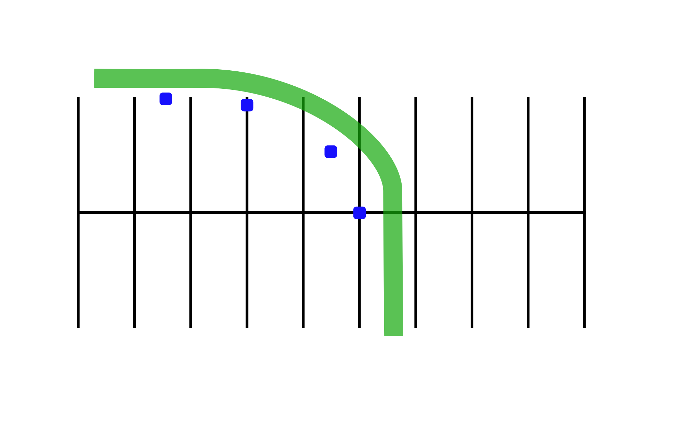

# Normal Stop on a Curve

## Directions

Practicing this exercise will help you stop smoothly in a curve. Ride to the outside of line "A". As you reach marker one, turn in the curved path indicated by markers two, three, and four. Once you enter the curved path, gradually apply both brakes and downshift. Do not release the clutch. Try to come to a smooth stop with your front tire next to marker four. Do this at 10 mph, then 15 mph.

## Coaching Tips

*  Keep head and eyes up; focus on where you want to stop.   Straighten up the motorcycle before you stop completely.   Use both brakes to stop.
*  Keep feet on pegs until almost stopped.
*  When stopped, the left foot should touch the ground first, and you should be in first gear.
*  Don't skid either tire.

## Problem Corrections
1. Overshooting the final marker. Apply more pressure to the brakes once motorcycle is straightened from the lean angle.
2. Motorcycle nearly falls over. As soon as you begin stopping, decrease your lean angle. Straighten up the motorcycle, and apply more pressure to the brakes. Before stopping be sure the handlebars are square with the motorcycle.
3. Rear wheel skids. Apply less pressure on the rear brake and make sure the motorcycle is straight up.