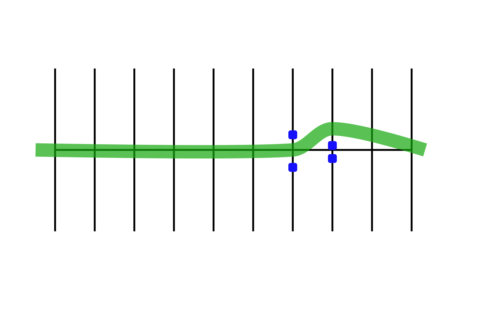

# Obstacle Swerve

## Directions

Practicing this exercise properly will help you swerve to avoid a potential hazard. Approach the first pair of markers. As you reach the markers you should be going 10-15 mph. Make sure you've decided on which direction you intend to go before starting the exercise. As your front tire passes the first pair of markers, swerve to the right or left. Go to the outside of the next marker but try not to cross line "A" or "B". Do not stop; continue at a steady speed and repeat the exercise.

## Coaching Tips
*  To swerve right, push right until you have cleared the marker, then push left to resume straight ahead travel.   Push on the handlebar in the same direction you want to go. (Push right to go right, push left to go left.)
  Do not brake and swerve at the same time.

## Problem Corrections
1. Unable to properly complete the swerve. Maintain pressure on the handlebar until you have cleared the marker. Avoid looking down; look where you want to go.
