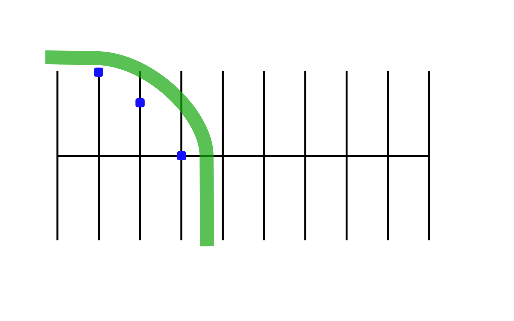

# Quick Stop on a Curve

## Directions

Practicing this exercise will help you stop quickly when something suddenly appears in your path on a curve. Ride to the outside of the line "A". Start, facing marker one at a distance sufficient enough to increase speed to 10-15 mph. As you reach marker one, turn in the curved path indicated by marker two, three, and four. When your front tire passes marker two, begin braking. Try to stop before marker three. Do this at 10 mph, then 15 mph. Do not exceed 15 mph.

## Coaching Tips
*  Keep head and eyes up; focus on where you want to go.
*  Straighten motorcycle, then apple both brakes stopping as quickly as possible.
*  Keep feet on pegs until almost stopped.
*  When stopped, the left foot should touch the ground first, and you should be in first gear.
*  Do not skid either wheel.

## Problem Corrections
1. Overshooting the final marker. Apply more pressure to the brakes once motorcycle is straightened from the lean angle.
2. Motorcycle nearly falls over. Straighten up the motorcycle, and then apply the brakes. Be sure the handlebars are square with the motorcycle.
3. Rear wheel skids. Apply less pressure on the rear brake and make sure the motorcycle is straight up.
