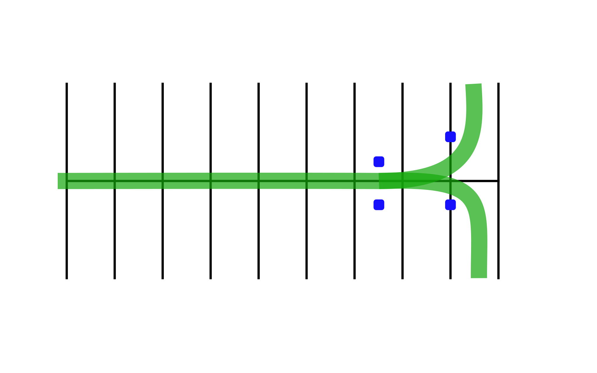

# Sharp Turns

## Directions
Practicing these drills will help you to make sharp turns from stoplights or stop signs, pulling out of parking spaces or driveways, and turning into a driveway, and turning into a driveway or onto a narrow street.

### Drill 1

Begin riding straight across the parking lot, increasing speed to approximately 10 mph. Just before reaching the "Begin Turning" Marker, slow down and use both brakes to adjust your speed for making a sharp turn. As you reach the line or marker make a sharp turn (left or right). Finish your turn as close to line "A" as you can without touching it. Remember to accelerate slightly coming out of the turn.

### Drill 2

Start at the marker. Begin making a sharp turn from the starting point. Finish your turn as close to line "A" as you can without hitting it.

## Coaching Tips
*  Keep head and eyes up; look where you want to be at the end of the turn.
*  Turn the handlebars and lean the motorcycle in the direction of the turn.
*  Use the friction zone of the clutch as you turn.
*  Accelerate as you leave the turn.
*  Cover the rear brake, and use both brakes lightly to reduce speed before the turn.   Practice left and right turns.

## Problem Corrections
1. Turning too short or too long. Keep eyes up and look through the turn. Don't look down.
2. Not sure when or where to turn. Start your turn when the front wheel passes the start marker. As you start your turn, turn your head and look to the exit point. Do not look down.
3. Motorcycle stalls of falls into the turn. Concentrate on maintaining steady speed or slight acceleration.
