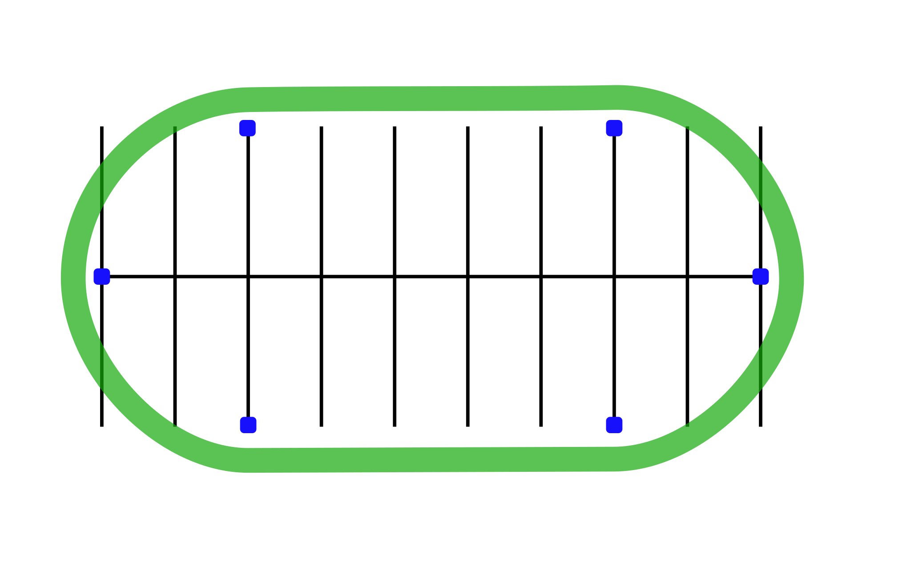

# Turning and Cornering

## Directions

Practicing these drills will help you in turning and cornering at higher speeds such as curves on highways and winding roads, especially when the curve is tighter than you anticipated.
Ride to the left around the oval indicated by markers one, two, three, four, five and six. Adjust your speed and lean angle so that a small throttle opening is held steady through marker one, two and three. Repeat the drill turning to the right.

## Coaching Tips

*  Beginning speed of 10-15 mph.
*  Slow down before the turn.
*  Look through the turn to where you want to go. Lean with the motorcycle.
*  Hold a steady speed or roll on the throttle gently through the turn.

## Problem Corrections

1. Swinging wide of the turn. Look for the exit point. Apply more pressure on the handlebar in the direction of the turn.
2. Cutting corners too close or turning too sharply. Look at the exit point. Do not look down. Apply less pressure to the inside handlebar.
3. Exiting wide out of the turn, making the oval into a circle. Look where you want to go. Apply more pressure to the inside handlebar.
