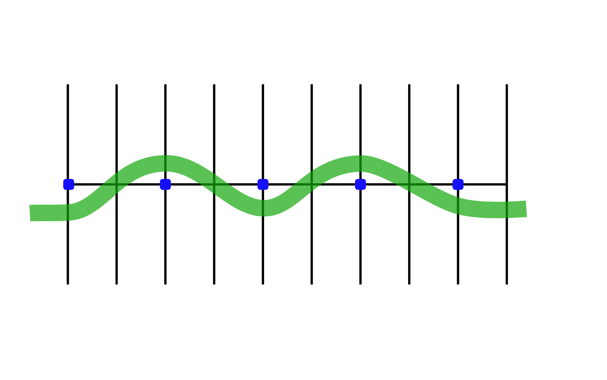

# Weaves

## Directions
Practicing these drills will help you in making quick lane changes in traffic or changes in direction.

### Drill 1

30-foot Weave - Begin at one end of the parking lot lines or markers. Go to the right of the first marker, left of the second, right of the third, and so on.

### Drill 2

20-foot Weave - Proceed the same as you did in the 30-foot weave.

## Coaching Tips
*  Keep head and eyes up. Avoid looking down; use your peripheral vision to locate the markers.
*  Turn by pushing on the handlebars in the direction of the turn. (Push right to go right; push left to go left.)
*  Lean with the motorcycle for the exercise.
*  Maintain a steady speed.

## Problem Corrections

1. Swinging too wide away from the markers. Look past the last marker, decrease lean angle and push less on the handlebars.
2. Hitting markers. Look past the last marker, increase lean angle slightly and push more on the handlebars.
