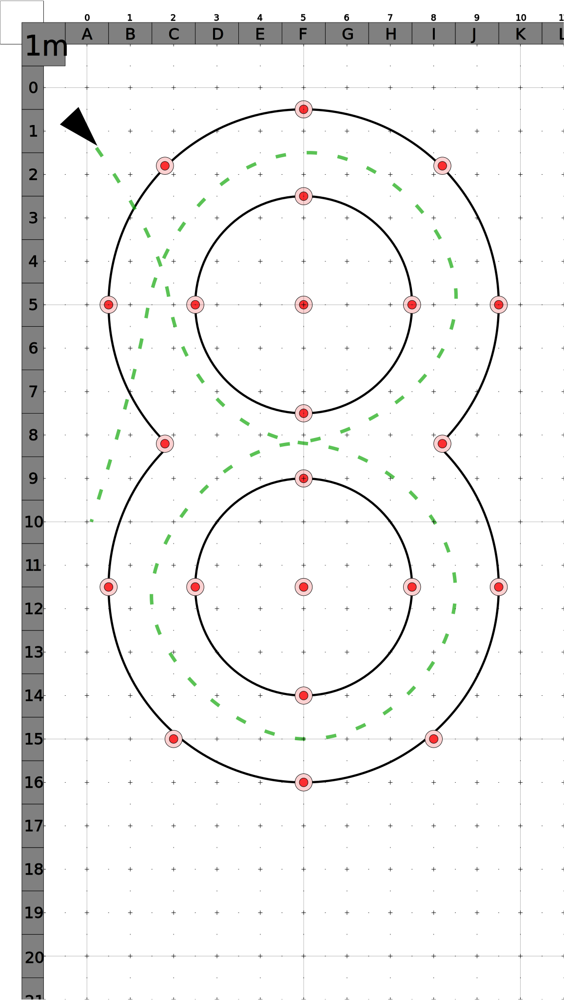

# Figure 8

**Q-Ride**

The figure 8 manoeuvre is executed as close as practicable around 2 circles, a maximum of **5 metres** in diameter, spaced **1.5 metres** apart but within **2 metres** of the outside diameter of the circles.

The learner will be required to complete 4 figure eights in a minimum time of **50 seconds** to a maximum time of **80 seconds** using appropriate gear (eg: first or second gear).

Use of rear brake is acceptable.
