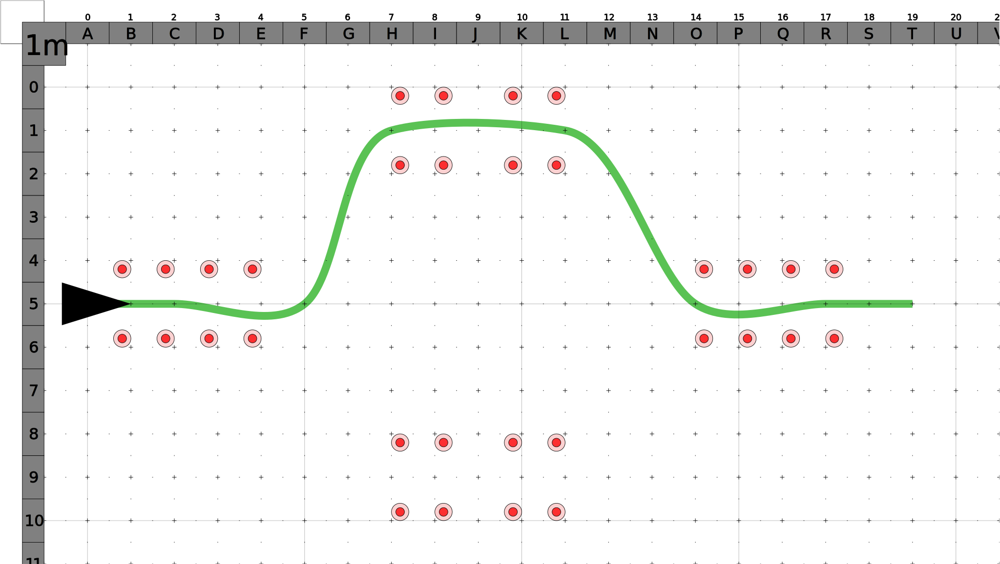
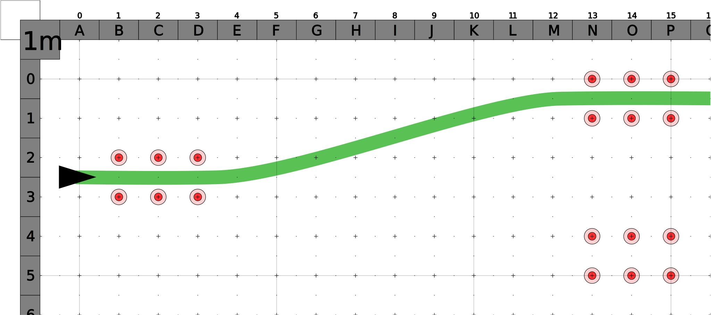

# Lane Change

## Slow speed

## Q-Ride (counter steering)

- Speed between **40 km/h** to a maximum **50 km/h**
- Approach lane does not exceed a width of **1 metre**
- Counter steering by **1.5 metres** within **10 metres**
- Manoeuvre completed within a 1 metre wide lane
