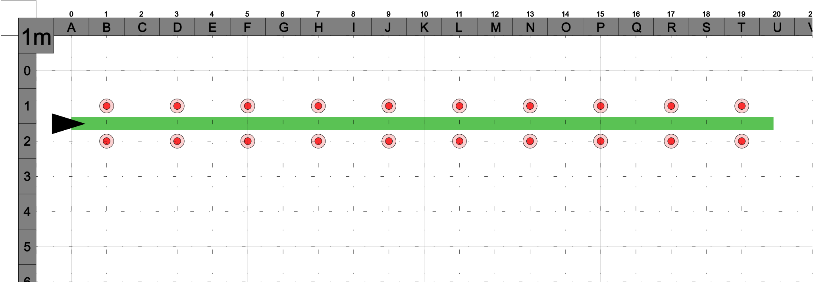

# Slow Ride

**Q-Ride**

- through a marked course **18 metres** long by **0.75 metres** wide
- keeping feet on footrests
- keeping motorbike wheels within marked course
- taking not less than **11 seconds** to traverse the course **(max 5.8 km/h)**
- using rear brake to control speed
